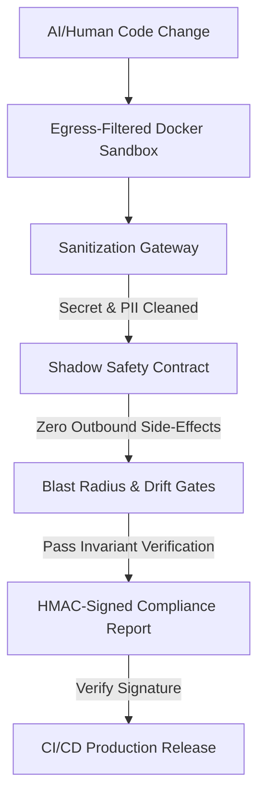

# 🏭 CenitForge V5

> **The Enterprise-Grade Framework for Autonomous AI-Agent Software Engineering**
>
> Build high-compliance, multi-tenant B2B SaaS applications with 100% automated, cryptographically-verified security guardrails and zero context drift.

<div align="center">

[](docs/plan-maestro-v5.md)
[](LICENSE)
[](CHANGELOG.md)
[](ARCHITECTURE.md)

</div>

---

## 🎯 The Core Problem: The AI Engineering Paradox

Autonomous AI Coding Agents (such as Claude Code, Cursor, and custom LLM builders) can write and refactor code at a speed no human developer can match. However, this unmatched velocity introduces a **critical safety paradox**:

```text
❌ TRADITIONAL AI DEVELOPMENT:
   [Prompt Input] ──> [AI Agent Generates Code] ──> [Hallucinations / Regression / PII Leaks] 
   
   ⚠️ Traditional guardrails (Linters, Unit Tests) are too reactive to prevent architectural decay.
```

An agent tasking a localized ticket will happily bypass Row-Level Security, commit exposed API keys, or drift from product specifications simply to make its tests pass. 

**CenitForge V5 solves this.** It transforms AI development from a reactive "code chat" into a **secure, programmatically-enforced production line**.

```text
🛡️ CENITFORGE VERIFIED DEVELOPMENT:
   [Prompt Input] ──> [Isolated Sandbox] ──> [Cryptographic Verification] ──> [Safe Release]
   
   🚀 The codebase remains auditable, secure, and immune to regression—completely verified by code.
```

---

## 🏛️ The Five Sentinel Guardrails of CenitForge

CenitForge replaces passive developer rules with **five autonomous, executing security engines** that monitor, sanitize, and verify every single code change:



### 1. 🔑 Programmatic Invariant Verification
The **Enforcement Verifier** (`/tools/enforcement_verifier.py`) programmatically asserts compliance with 20 critical invariants (e.g., Row-Level Security, decimal handling, webhook signature validation). Upon verification, it signs the audit report with a secure **HMAC-SHA256 signature**—which CI/CD strictly requires before any deployment.

### 2. 🛡️ Sanitization Gateway
The **Sanitizer Proxy** (`/sanitization/gateway.py`) intercepts all outbound payloads going to external LLMs, scrubbing credentials, exposed API keys, and sensitive PII data before they leave your private network.

### 3. 🧪 Shadow Safety Contract
The **Shadow Test Runner** (`/tests/shadow/shadow_safety_contract.py`) monkey-patches outbound network clients (Stripe, SendGrid) during shadow testing. It allows you to run generated billing logic in production safely without double-charging users or sending duplicate transactional emails.

### 4. 📐 Blast Radius & Scope Creep Gate
Our **Blast Radius CI Gate** (`/ci/blast_radius_gate.py`) evaluates the physical Git Diff of a pull request against the authorized file-budget declared in the agent's ticket. If the agent touches files outside its scope by >10%, the PR is automatically blocked.

### 5. 📉 Semantic Drift Circuit Breaker
The **Drift Detector** (`/tools/semantic_drift_detector.py`) computes the vector cosine similarity between the original PRD requirements and the generated codebase. If the code drifts below 0.85 similarity, it trips a **Circuit Breaker** to halt execution and prevent context decay.

---

## 📊 Traditional AI Coding vs. CenitForge Engineering

| Capability | Traditional AI Coding | CenitForge Engineering |
|------------|-----------------------|-----------------------|
| **Multi-Tenant Security** | Declarative instructions (high leak risk) | Programmatic RLS + Verifier check |
| **API Secret Leaks** | Pre-commit hooks only (regex stubs) | Hard Vault checks + Sanitizer Proxy |
| **Outbound Testing** | Manual staging or mock files | Automated Shadow Safety Contract |
| **Scope creep** | Uncontrolled changes to unrelated files | strict Blast Radius PR Gate |
| **Context Decay** | Progressive code quality loss | Semantic Drift Cosine Circuit Breaker |
| **Compliance Proof** | Manual checklists and audits | Cryptographically signed JSON reports |

---

## 📂 The 121-File Blueprint

CenitForge is not just a framework—it is a **fully materialized, ready-to-run template repository** that provides:
*   **Infrastructure as Code (IaC):** Multi-tenant RDS DB, HashiCorp Vault HA, and ECS Sanitizer Terraform modules.
*   **GitHub Actions CI/CD:** 5 production-grade workflows running PR gates, audits, and deployments.
*   **Operational Runbooks:** 6 step-by-step incident response playbooks for SRE/DevOps.
*   **Architecture Decision Records (ADRs):** 10 detailed engineering records (tenancy, idempotency, etc.).

📖 **Want a high-level technical overview?** Read the [Technical Executive Summary](TECHNICAL_EXECUTIVE_SUMMARY.md).  
📖 **Want to dive deep into the 15,000-line specification?** Read the [Plan Maestro V5](docs/plan-maestro-v5.md).

---

## 🚀 Quickstart: Bootstrap a SaaS in 5 Minutes

### 1. Setup CenitForge locally
Verify you have Python 3.11+, Terraform 1.5+, and Docker 24+. Then clone the kit:
```bash
git clone https://github.com/your-org/CenitForge.git
cd CenitForge
make install
```

### 2. Validate the Kit Integrity
Run our multi-platform validator to verify the 121 files are fully complete:
```bash
python scripts/validate_kit.py
```

### 3. Generate a Parameterized SaaS Project
Generate a fully customized, multi-tenant SaaS ready for M3 production:
```bash
make new-project
# Interactive Cuestionario:
#   project_name [My SaaS Product]: CenitBilling
#   initial_maturity (M1/M2/M3) [M1]: M3
#   primary_llm_provider (anthropic/openai/google) [anthropic]: anthropic
#   has_billing (yes/no) [yes]: yes
```

### 4. Initialize and Verify Your SaaS
```bash
cd cenitbilling
make setup
make verify
# ✅ PostgreSQL RLS Policies: PASS
# ✅ Vault Auto-Unseal Integration: PASS
# ✅ Sanitizer Proxy: ACTIVE
# 🚀 Ready to code safely!
```

---

## 🎓 Team Training & Onboarding

| Discipline | Duration | Manual |
|------------|:--------:|--------|
| **Software Engineers** | 16 hours | [engineer-onboarding.md](docs/training/engineer-onboarding.md) |
| **Product Managers (PMs)** | 8 hours | [pm-onboarding.md](docs/training/pm-onboarding.md) |
| **DevOps / SRE / Platform** | 24 hours | [devops-onboarding.md](docs/training/devops-onboarding.md) |
| **Security & Compliance** | 12 hours | [security-onboarding.md](docs/training/security-onboarding.md) |

---

## 🤝 Contribution & Governance

CenitForge is an open-source initiative under the **MIT License**. We welcome contributions to add new invariants, refine security linters, and improve sandboxing scripts. Please review [CONTRIBUTING.md](CONTRIBUTING.md) before submitting pull requests.

---

<div align="center">

**Developed by CenitLabs**  
*Building the future of Autonomous AI Software Engineering with Absolute Mathematical Safety.*

[🚀 Quickstart Tutorial](QUICKSTART.md) · [📘 Plan Maestro V5](docs/plan-maestro-v5.md) · [📊 Executive Summary](TECHNICAL_EXECUTIVE_SUMMARY.md)

</div>
