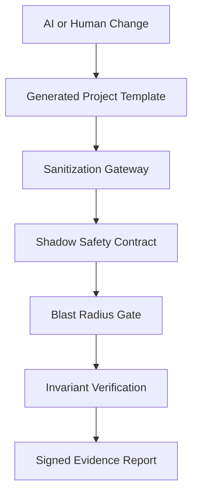

# 🏭 CenitForge

> **Developer Preview for auditable AI-agent software engineering**
>
> Turn AI coding from “hope the agent did the right thing” into a workflow with templates, guardrails, smoke checks, and signed evidence.

<div align="center">

[](docs/project-status.md)
[](LICENSE)
[](docs/mvp-roadmap.md)
[](cookiecutter.json)

**English** · [Español](README_ES.md)

</div>

---

## ✨ What is CenitForge?

CenitForge is a **developer-preview framework and executable project-template seed** for teams that want to use AI coding agents without losing control of architecture, security, billing, or multi-tenant boundaries.

It gives you a structured way to move from:

```text
Prompt -> AI Agent -> Code Changes -> Manual Review Panic
```

into:

```text
PRD + Contracts -> Micro-Prompt -> Guardrails -> Smoke Checks -> Signed Evidence
```

CenitForge is **not yet a turnkey production platform**. It is the first public implementation of the operating model: documentation, project generator, and early executable sentinels that can be hardened into a full platform.

---

## 🎯 The problem: AI speed without safety rails

AI agents can move fast. Too fast, sometimes.

They can:

- modify files outside the intended scope;
- make tests pass while weakening the real behavior;
- forget tenant boundaries;
- leak secrets or PII into prompts/logs;
- drift away from the original PRD;
- touch billing logic without enough protection.

CenitForge exists to make those risks **visible, testable, and auditable**.

It does not promise magical safety. It gives you a path to build practical enforcement around agentic development.

---

## 🛡️ The Five Sentinels

The current sentinels are provided as **seed implementations inside the generated project template**.



| Sentinel | What it protects | Current location | Status |
|---|---|---|---|
| 🔑 Enforcement Verifier | Critical invariants such as RLS, decimals, billing gates, secrets | `templates/{{cookiecutter.project_slug}}/tools/enforcement_verifier.py` | Seed |
| 🛡️ Sanitization Gateway | PII/secrets before payloads reach external LLMs | `templates/{{cookiecutter.project_slug}}/sanitization/gateway.py` | Seed |
| 🧪 Shadow Safety Contract | Billing/outbound side effects during shadow testing | `templates/{{cookiecutter.project_slug}}/tests/shadow/shadow_safety_contract.py` | Seed |
| 📐 Blast Radius Gate | Scope creep in PR diffs | `templates/{{cookiecutter.project_slug}}/ci/blast_radius_gate.py` | Seed |
| 📉 Semantic Drift Detector | PRD-to-code drift using embeddings | `templates/{{cookiecutter.project_slug}}/tools/semantic_drift_detector.py` | Seed |

Future releases will move these into a reusable package namespace such as `cenitforge.enforcement`, `cenitforge.sanitization`, and `cenitforge.shadow`.

---

## 🧭 What is real today vs. what is planned?

| Capability | Today | Next milestone |
|---|---|---|
| Master methodology | ✅ Available in docs | Keep refining through audits |
| Project generator | ✅ Cookiecutter seed | More tested generated projects |
| Sentinels | ✅ Seed implementations in template | Root package + full unit tests |
| Smoke validation | ✅ Structural and syntax checks | End-to-end demo report |
| CI/CD enforcement | ⚠️ Partial / planned | GitHub Actions gates |
| Production orchestrator | 🚧 Planned | M3 workflow integration |
| Release packaging | 🚧 Planned | `v0.1.0-developer-preview` |

For the honest implementation matrix, see [`docs/project-status.md`](docs/project-status.md).

---

## 🚀 Quickstart

### 1. Clone and install

```bash
git clone https://github.com/CenitLabs-mx/CenitForge.git
cd CenitForge
make install
```

### 2. Validate the kit

```bash
make validate
make smoke
```

`make validate` checks the kit structure.

`make smoke` checks that the current sentinel seed files exist and compile, then runs a minimal sanitization smoke test.

### 3. Generate a project

```bash
make new-project
```

The generated project will contain the sentinel seed files under its own `tools/`, `sanitization/`, `ci/`, and `tests/` folders.

### Windows / PowerShell

If you are on Windows and do not use GNU Make, run:

```powershell
python .\scripts\validate_kit.py
.\scripts\smoke-demo.ps1
python -m pip install cookiecutter pyyaml
cookiecutter .\templates --output-dir ..
```

---

## 🧪 The smallest useful demo

The immediate goal is simple:

```text
Generate project -> run smoke checks -> block one unsafe payload -> produce evidence
```

That loop matters more than adding more documentation. See [`docs/mvp-roadmap.md`](docs/mvp-roadmap.md).

---

## 🧱 Repository map

```text
.
├── README.md
├── README_ES.md
├── QUICKSTART.md
├── Makefile
├── cookiecutter.json
├── docs/
│   ├── plan-maestro-v5.md
│   ├── project-status.md
│   └── mvp-roadmap.md
├── scripts/
│   ├── validate_kit.py
│   ├── validate-kit.sh
│   ├── smoke-demo.sh
│   └── new-project.sh
└── templates/
    └── {{cookiecutter.project_slug}}/
        ├── tools/
        ├── sanitization/
        ├── ci/
        ├── tests/
        └── docs/
```

---

## 🧠 Philosophy

CenitForge follows three principles:

1. **Agents accelerate work; they do not lower standards.**
2. **Documentation is useful, but enforcement is better.**
3. **Claims must be backed by executable checks.**

That is why the project is now labeled as a developer preview: the direction is ambitious, but the public release should only claim what it can currently demonstrate.

---

## 🤝 Contributing

The best contributions right now are practical and testable:

- unit tests for the five sentinels;
- a working end-to-end demo project;
- stronger sanitization cases;
- CI examples that run the guardrails;
- better Windows/PowerShell developer experience;
- documentation that keeps scope honest.

Read [`CONTRIBUTING.md`](CONTRIBUTING.md) before opening a pull request.

---

<div align="center">

**Developed by CenitLabs**  
*Building auditable AI-agent engineering workflows, one guardrail at a time.*

[🚀 Quickstart](QUICKSTART.md) · [📘 Master Plan](docs/plan-maestro-v5.md) · [🧭 Project Status](docs/project-status.md) · [🛣️ MVP Roadmap](docs/mvp-roadmap.md)

</div>
