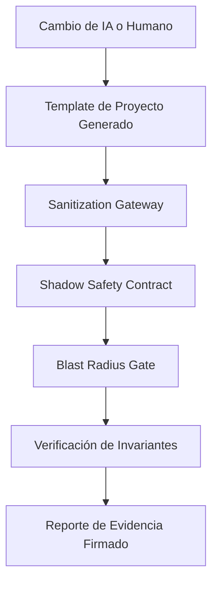

# 🏭 CenitForge

> **Developer Preview para ingeniería de software auditable con agentes de IA**
>
> Convierte el desarrollo con agentes de IA de “espero que el agente haya hecho lo correcto” a un flujo con plantillas, guardrails, smoke checks y evidencia firmada.

<div align="center">

[](docs/project-status.md)
[](LICENSE)
[](docs/mvp-roadmap.md)
[](cookiecutter.json)

[English](README.md) · **Español**

</div>

---

## ✨ ¿Qué es CenitForge?

CenitForge es un **framework en developer preview y una semilla ejecutable de proyecto** para equipos que quieren usar agentes de código con IA sin perder control sobre arquitectura, seguridad, billing o límites multi-tenant.

Te ayuda a pasar de:

```text
Prompt -> Agente IA -> Cambios de código -> Revisión manual con miedo
```

hacia:

```text
PRD + Contratos -> Micro-Prompt -> Guardrails -> Smoke Checks -> Evidencia firmada
```

CenitForge **todavía no es una plataforma productiva llave en mano**. Es la primera implementación pública del modelo operativo: documentación, generador de proyectos y primeros centinelas ejecutables que pueden endurecerse hasta convertirse en una plataforma completa.

---

## 🎯 El problema: velocidad de IA sin barandales

Los agentes de IA se mueven rápido. A veces, demasiado rápido.

Pueden:

- modificar archivos fuera del alcance autorizado;
- hacer pasar tests mientras debilitan el comportamiento real;
- olvidar límites entre tenants;
- filtrar secretos o PII en prompts/logs;
- desviarse del PRD original;
- tocar lógica de billing sin suficiente protección.

CenitForge existe para hacer esos riesgos **visibles, testeables y auditables**.

No promete seguridad mágica. Te da una ruta práctica para construir enforcement alrededor del desarrollo agéntico.

---

## 🛡️ Los Cinco Centinelas

Los centinelas actuales se entregan como **implementaciones seed dentro del template de proyecto generado**.



| Centinela | Qué protege | Ubicación actual | Estado |
|---|---|---|---|
| 🔑 Enforcement Verifier | Invariantes críticas como RLS, decimales, billing gates y secretos | `templates/{{cookiecutter.project_slug}}/tools/enforcement_verifier.py` | Seed |
| 🛡️ Sanitization Gateway | PII/secretos antes de que payloads lleguen a LLMs externos | `templates/{{cookiecutter.project_slug}}/sanitization/gateway.py` | Seed |
| 🧪 Shadow Safety Contract | Efectos secundarios de billing/outbound durante shadow testing | `templates/{{cookiecutter.project_slug}}/tests/shadow/shadow_safety_contract.py` | Seed |
| 📐 Blast Radius Gate | Scope creep en diffs de PR | `templates/{{cookiecutter.project_slug}}/ci/blast_radius_gate.py` | Seed |
| 📉 Semantic Drift Detector | Desvío entre PRD y código usando embeddings | `templates/{{cookiecutter.project_slug}}/tools/semantic_drift_detector.py` | Seed |

En releases futuros estos componentes se moverán a un paquete reutilizable como `cenitforge.enforcement`, `cenitforge.sanitization` y `cenitforge.shadow`.

---

## 🧭 ¿Qué es real hoy y qué está planeado?

| Capacidad | Hoy | Próximo hito |
|---|---|---|
| Metodología maestra | ✅ Disponible en docs | Refinarla con auditorías |
| Generador de proyectos | ✅ Seed con Cookiecutter | Más proyectos generados probados |
| Centinelas | ✅ Implementaciones seed en template | Paquete raíz + unit tests completos |
| Smoke validation | ✅ Checks estructurales y sintaxis | Demo end-to-end con reporte |
| Enforcement CI/CD | ⚠️ Parcial / planeado | Gates de GitHub Actions |
| Orquestador productivo | 🚧 Planeado | Integración M3 |
| Release packaging | 🚧 Planeado | `v0.1.0-developer-preview` |

Para la matriz honesta de implementación, revisa [`docs/project-status.md`](docs/project-status.md).

---

## 🚀 Inicio rápido

### 1. Clonar e instalar

```bash
git clone https://github.com/CenitLabs-mx/CenitForge.git
cd CenitForge
make install
```

### 2. Validar el kit

```bash
make validate
make smoke
```

`make validate` revisa la estructura del kit.

`make smoke` comprueba que los archivos seed de los centinelas existan y compilen, y ejecuta una prueba mínima de sanitización.

### 3. Generar un proyecto

```bash
make new-project
```

El proyecto generado tendrá los centinelas seed dentro de sus propias carpetas `tools/`, `sanitization/`, `ci/` y `tests/`.

### Windows / PowerShell

Si estás en Windows y no usas GNU Make:

```powershell
python .\scripts\validate_kit.py
.\scripts\smoke-demo.ps1
python -m pip install cookiecutter pyyaml
cookiecutter .\templates --output-dir ..
```

---

## 🧪 El demo mínimo útil

El objetivo inmediato es simple:

```text
Generar proyecto -> correr smoke checks -> bloquear un payload inseguro -> producir evidencia
```

Ese ciclo vale más que agregar más documentación. Revisa [`docs/mvp-roadmap.md`](docs/mvp-roadmap.md).

---

## 🧱 Mapa del repositorio

```text
.
├── README.md
├── README_ES.md
├── QUICKSTART.md
├── Makefile
├── cookiecutter.json
├── docs/
│   ├── plan-maestro-v5.md
│   ├── project-status.md
│   └── mvp-roadmap.md
├── scripts/
│   ├── validate_kit.py
│   ├── validate-kit.sh
│   ├── smoke-demo.sh
│   └── new-project.sh
└── templates/
    └── {{cookiecutter.project_slug}}/
        ├── tools/
        ├── sanitization/
        ├── ci/
        ├── tests/
        └── docs/
```

---

## 🧠 Filosofía

CenitForge sigue tres principios:

1. **Los agentes aceleran el trabajo; no reducen los estándares.**
2. **La documentación ayuda, pero el enforcement protege mejor.**
3. **Toda promesa debe estar respaldada por checks ejecutables.**

Por eso ahora el proyecto se presenta como developer preview: la visión es ambiciosa, pero el release público solo debe prometer lo que puede demostrar hoy.

---

## 🤝 Contribuir

Las mejores contribuciones ahora mismo son prácticas y verificables:

- unit tests para los cinco centinelas;
- un demo end-to-end funcional;
- mejores casos de sanitización;
- ejemplos de CI que ejecuten los guardrails;
- mejor experiencia en Windows/PowerShell;
- documentación que mantenga el alcance honesto.

Consulta [`CONTRIBUTING.md`](CONTRIBUTING.md) antes de abrir un pull request.

---

<div align="center">

**Desarrollado por CenitLabs**  
*Construyendo flujos de ingeniería agéntica auditables, un guardrail a la vez.*

[🚀 Quickstart](QUICKSTART.md) · [📘 Plan Maestro](docs/plan-maestro-v5.md) · [🧭 Estado del Proyecto](docs/project-status.md) · [🛣️ Roadmap MVP](docs/mvp-roadmap.md)

</div>
