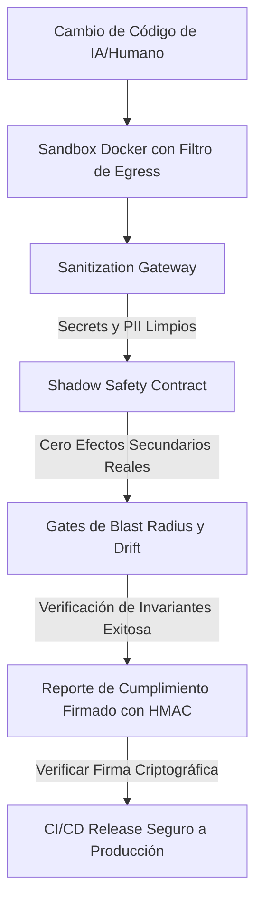

# 🏭 CenitForge V5

> **El Framework de Grado Empresarial para Ingeniería de Software con Agentes Autónomos de IA**
>
> Construye aplicaciones SaaS B2B multi-tenant con guardias de seguridad 100% automatizados y verificados criptográficamente, previniendo regresiones y el desvío contextual de la IA.

<div align="center">

[](docs/plan-maestro-v5.md)
[](LICENSE)
[](CHANGELOG.md)
[](ARCHITECTURE.md)

</div>

---

## 🎯 El Problema Central: La Paradoja de la Ingeniería con IA

Los agentes autónomos de codificación (como Claude Code, Cursor y constructores LLM a medida) pueden escribir y refactorizar código a una velocidad que ningún desarrollador humano puede igualar. Sin embargo, esta velocidad introduce una **paradoja de seguridad crítica**:

```text
❌ DESARROLLO TRADICIONAL CON IA:
   [Prompt / Instrucción] ──> [Agente Genera Código] ──> [Alucinaciones / Regresiones / Fugas de PII] 
   
   ⚠️ Los guardias tradicionales (Linters, Unit Tests) son demasiado reactivos para prevenir el deterioro arquitectónico.
```

Un agente autónomo, con tal de resolver un ticket local y hacer pasar sus pruebas unitarias, ignorará alegremente las políticas de Row-Level Security, subirá claves de API expuestas o desviará el alcance del diseño respecto al PRD original.

**CenitForge V5 resuelve esto.** Transforma el desarrollo con IA de un "chat de código" reactivo a una **línea de producción controlada con enforcement técnico**.

```text
🛡️ DESARROLLO VERIFICADO CON CENITFORGE:
   [Prompt / Instrucción] ──> [Sandbox Aislado] ──> [Verificación Criptográfica] ──> [Release Seguro]
   
   🚀 El código permanece auditable, robusto e inmune a regresiones—verificado programáticamente.
```

---

## 🏛️ Los Cinco Centinelas de CenitForge

CenitForge reemplaza la confianza documental con **cinco motores de seguridad autónomos** que monitorean, sanitizan y verifican cada cambio de código en ejecución:



### 1. 🔑 Verificación Programática de Invariantes
El **Enforcement Verifier** (`/tools/enforcement_verifier.py`) evalúa programáticamente el cumplimiento de 20 invariantes críticas (por ejemplo, Postgres Row-Level Security, manejo financiero decimal, validación de firmas de Stripe). Tras validar, firma el reporte con **HMAC-SHA256**—requisito obligatorio para que el CI/CD permita el deployment.

### 2. 🛡️ Sanitization Gateway
El **Sanitizer Proxy** (`/sanitization/gateway.py`) intercepta todos los payloads de salida hacia LLMs externos, ofuscando credenciales, API keys y datos personales (PII) sensibles antes de que salgan de tu red privada.

### 3. 🧪 Shadow Safety Contract
El **Shadow Test Runner** (`/tests/shadow/shadow_safety_contract.py`) intercepta los clientes de servicios externos (Stripe, SendGrid) durante shadow testing. Te permite probar código de facturación generado por la IA en producción real sin duplicar cargos ni enviar emails reales a usuarios reales.

### 4. 📐 Blast Radius & Gate de Scope Creep
Nuestro **Blast Radius CI Gate** (`/ci/blast_radius_gate.py`) evalúa el Git Diff físico del PR contra el presupuesto de archivos autorizados en el micro-prompt de la IA. Si el agente modifica archivos fuera de su scope por más del 10%, el PR se bloquea de inmediato.

### 5. 📉 Semantic Drift Circuit Breaker
El **Drift Detector** (`/tools/semantic_drift_detector.py`) mide la similitud coseno de embeddings vectoriales entre los requisitos funcionales del PRD original y el código generado. Si la similitud cae por debajo de 0.85, se activa un **Circuit Breaker** que detiene la ejecución para prevenir el desvío contextual.

---

## 📊 Desarrollo de IA Tradicional vs. Ingeniería CenitForge

| Capacidad | Desarrollo de IA Tradicional | Ingeniería CenitForge |
|------------|-----------------------|-----------------------|
| **Seguridad Multi-Tenant** | Instrucciones en prompts (alto riesgo) | Políticas RLS + Verificador programático |
| **Fuga de Secretos/Keys** | Hooks pre-commit básicos (placeholders) | Chequeos duros en Vault + Sanitizer Proxy |
| **Pruebas de Outbound** | Mocks locales o staging manual | Shadow Safety Contract automatizado |
| **Scope Creep (Desvío)** | Cambios descontrolados a archivos colaterales | Control de Blast Radius PR Gate estricto |
| **Deterioro Contextual** | Degeneración progresiva del código | Semantic Drift Cosine Circuit Breaker |
| **Prueba de Cumplimiento** | Checklists manuales y auditorías | Reportes JSON firmados criptográficamente |

---

## 📂 El Framework de 121 Archivos

CenitForge no es solo teoría—es una **plantilla de repositorio completamente materializada** que te entrega:
*   **Infraestructura como Código (IaC):** Módulos de Terraform para RDS PostgreSQL SaaS, EC2 Vault HA y ECS Sanitizer.
*   **GitHub Actions CI/CD:** 5 workflows productivos que corren PR gates, auditorías regulatorias y deploys.
*   **Runbooks Operativos:** 6 manuales de contingencia detallados para SRE y DevOps (ej. fugas cross-tenant).
*   **ADRs (Architecture Decision Records):** 10 decisiones de diseño documentadas (tenancy, idempotencia, etc.).

📖 **¿Quieres una perspectiva ejecutiva rápida?** Lee el [Resumen Ejecutivo Técnico](RESUMEN_EJECUTIVO_TECNICO.md).  
📖 **¿Quieres profundizar en las 15,000 líneas del Plan Maestro?** Lee el [Plan Maestro V5](docs/plan-maestro-v5.md).

---

## 🚀 Inicio Rápido: Despliega tu SaaS en 5 Minutos

### 1. Preparar CenitForge Localmente
Asegúrate de contar con Python 3.11+, Terraform 1.5+ y Docker 24+. Luego clona el kit:
```bash
git clone https://github.com/CenitLabs-mx/CenitForge.git
cd CenitForge
make install
```

### 2. Validar la Integridad del Kit
Corre nuestro validador multiplataforma para comprobar que todos los archivos estén listos:
```bash
python scripts/validate_kit.py
```

### 3. Generar un Proyecto SaaS Parametrizado
Genera un SaaS B2B a la medida y con matices de madurez configurados al instante:
```bash
make new-project
# Cuestionario Interactivo:
#   project_name [Mi SaaS B2B]: CenitBilling
#   initial_maturity (M1/M2/M3) [M1]: M3
#   primary_llm_provider (anthropic/openai/google) [anthropic]: anthropic
#   has_billing (yes/no) [yes]: yes
```

### 4. Inicializar y Verificar tu SaaS
```bash
cd cenitbilling
make setup
make verify
# ✅ PostgreSQL RLS Policies: PASS
# ✅ Vault Auto-Unseal Integration: PASS
# ✅ Sanitizer Proxy: ACTIVE
# 🚀 ¡Listo para codificar de forma segura con IA!
```

---

## 🎓 Capacitación del Equipo por Rol

| Disciplina | Duración | Manual |
|------------|:--------:|--------|
| **Software Engineers** | 16 horas | [engineer-onboarding.md](docs/training/engineer-onboarding.md) |
| **Product Managers (PMs)** | 8 horas | [pm-onboarding.md](docs/training/pm-onboarding.md) |
| **DevOps / SRE / Platform** | 24 horas | [devops-onboarding.md](docs/training/devops-onboarding.md) |
| **Security & Compliance** | 12 hours | [security-onboarding.md](docs/training/security-onboarding.md) |

---

## 🤝 Contribución y Gobernanza

CenitForge es una iniciativa de código abierto bajo la licencia **MIT**. Damos la bienvenida a contribuciones para agregar invariantes, optimizar linters o refinar el sandbox Docker. Por favor consulta [CONTRIBUTING.md](CONTRIBUTING.md) antes de enviar pull requests.

---

<div align="center">

**Desarrollado por CenitLabs**  
*Construyendo el futuro de la ingeniería agéntica con absoluta seguridad matemática.*

[🚀 Guía Quickstart](QUICKSTART.md) · [📘 Plan Maestro V5](docs/plan-maestro-v5.md) · [📊 Resumen Ejecutivo](RESUMEN_EJECUTIVO_TECNICO.md)

</div>
