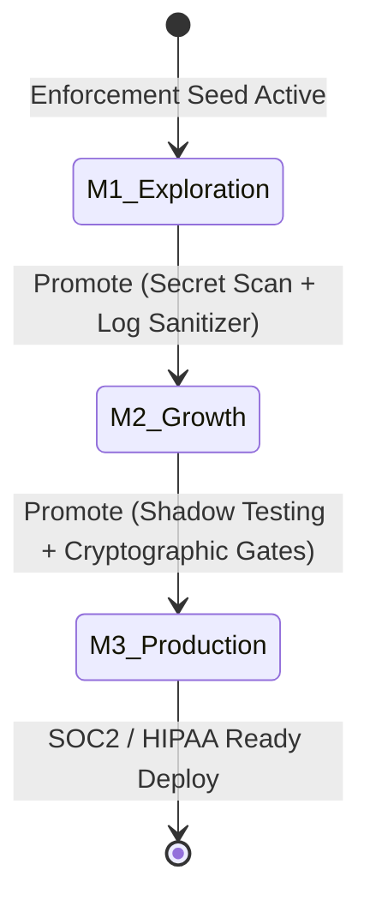

# Technical Executive Summary: CenitForge V5

## Executive Overview: The AI Security & Engineering Paradox

The integration of Autonomous AI Agents (like Claude Code, Cursor, or custom LLM builders) in the software development lifecycle presents a major architectural paradox: **Agents produce code at a velocity that far outpaces human review, yet their execution remains prone to regressions, API hallucinations, silent data leaks (PII), and context drift.**

Traditional software guardrails (like unit tests, linters, and standard CI/CD) are **reactive and incomplete**. They assume a human programmer who understands architectural constraints. An AI agent, operating without physical boundaries, can easily bypass declarative documentation or "prompt instructions" to solve a localized ticket, introducing critical security and compliance anomalies in the broader codebase.

**CenitForge V5** solves this paradox by introducing **CenitLabs' Verified Agentic Development Pattern**. It shifts the paradigm from *passive/declarative* documentation to **programmatic, cryptographically-enforced engineering invariants**.

```text
       Traditional AI Coding: [Chat Prompt] ──> [Raw Code] ──> [High Regression Risk]
       
       CenitForge Pattern:    [Spec Lock]  ──> [Sandbox]  ──> [Cryptographic Verification] ──> [Zero Regression]
```

CenitForge provides a complete, production-grade template repository to build multi-tenant B2B SaaS applications where **every single code change generated by an AI or human is executed in an isolated sandbox, sanitised, and cryptographically verified against 20 security invariants before integration.**

---

## 🏛️ The Five Core Engineering Safeguards (Guardrails)

CenitForge replaces trust with programmatic enforcement. The framework operates five autonomous safety engines:

### 1. The Enforcement Verifier (`/tools/enforcement_verifier.py`)
Rather than relying on developers to remember security rules, this engine **programmatically assets compliance**. Before any phase transition or Git commit, it queries the local database and environment to verify technical constraints (such as Postgres Row-Level Security, active Vault integrations, or float-to-bigint schema rules).
*   **Cryptographic Attestation:** Once validated, the engine signs a JSON verification report using a secure HMAC-SHA256 signature. The Orchestrator blocks any pipeline or deployment if a report lacks a valid signature.

### 2. The Sanitization Gateway (`/sanitization/gateway.py`)
Autonomous agents must communicate with external LLMs to operate. This gateway acts as a **local proxy sanitizer** that intercepts all payloads outbound to LLMs.
*   **PII & Secrets Scrubbing:** Integrated with local NLP engines (like Presidio) and custom regex rules, it pseudonymizes emails, credentials, API keys, and sensitive database columns before they reach external networks.

### 3. The Shadow Safety Contract (`/tests/shadow/shadow_safety_contract.py`)
Testing new AI-generated business logic (like billing, upgrades, or multi-tenant sync) in production normally risks double-charging customers or triggering duplicate outbound transactional emails.
*   **Outbound Side-Effect Interception:** This contract monkey-patches outbound network clients (Stripe, SendGrid, Internal Accounting) in the shadow environment. It registers, validates, and compares execution paths without triggering any real outbound side-effects, generating alert tickets if discrepancies are found.

### 4. The Blast Radius Gate (`/ci/blast_radius_gate.py`)
To prevent an agent from performing "scope creep" (modifying files outside its designated ticket to fix a bug), this CI gate compares the list of modified files in the physical Git diff against the authorized budget declared in the agent's micro-prompt template. It blocks the pull request if the *scope creep* exceeds a strict 10% threshold.

### 5. The Semantic Drift Detector (`/tools/semantic_drift_detector.py`)
Over multiple continuous code-generation cycles, agents suffer from "context decay" where the generated codebase progressively drifts away from the Product Requirements Document (PRD).
*   **Vector Cosine Similarity:** This detector computes embeddings of the original PRD, the generated code, and the test suite using sentence-transformer models. If the cosine similarity drops below 0.85, it triggers a **Circuit Breaker** that halts execution, preventing infinite loops and context contamination.

---

## 📊 The 3-Tier Maturity Lifecycle (M1 ──> M2 ──> M3)

CenitForge scales its engineering rigour with the operational risk of the project:



*   **M1 (Exploration):** Fast-prototyping. The framework deploys an **Enforcement Seed** (`/infrastructure/enforcement-seed.yaml`) which registers RLS skeletons, Vault stubs, and secret scanners. The controls are in *observation mode* (log-only), preventing early refactoring friction.
*   **M2 (Growth):** Active customer beta. Enforcement moves to *blocking mode* for core invariants. Fully-functional log sanitization and noisy-neighbor test cases become mandatory.
*   **M3 (Production):** High-compliance (SOC2/HIPAA ready). Every gate requires an Enforcement Verifier signature. Shadow testing for billing is strictly active, and Docker sandboxing with absolute egress filtering is enforced for all agent execution processes.

---

## 📂 The 121-File Artifact Framework

When CenitForge generates a project, it creates a fully modular workspace composed of 121 files distributed across the following architectural layers:

1.  **Architecture Decision Records (ADRs 0001-0010):** Documented engineering strategies covering shared schema multi-tenancy, Stripe webhook handling, idempotency unique keys, and zero-downtime database migrations (Expand-and-Contract).
2.  **Infrastructure as Code (IaC):** Reusable Terraform modules to provision highly-available RDS PostgreSQL instances optimized for SaaS, EC2 HashiCorp Vault instances with KMS auto-unseal, and ECS Sanitization Gateway clusters.
3.  **Docker Egress Sandbox:** Dockerfiles and shell scripts that restrict outbound network calls. It blocks access to cloud metadata endpoints (169.254.169.254) and private subnets, allowing calls only to whitelisted LLM domains.
4.  **Operational Runbooks (RUN-001 to RUN-006):** Step-by-step incident response guides for DevOps and SRE teams to handle critical scenarios like cross-tenant data leaks, compromised keys, billing discrepancies, and database failovers.
5.  **GitHub CI/CD Workflows:** 5 production-ready pipelines that run PR gates, blue-green deployments, daily regulatory monitor scrapers, and weekly quarantine audits.

---

## 📈 Audit Score: 97/100 (Approved for M3 Production)

CenitForge V5 has been thoroughly audited by three independent technical AI agents (Kimi 2.6, Opus 4.6, Qwen 3.7 Max), scoring **97 out of 100 points** in standard enterprise compliance and SaaS resilience.

### Key Strengths Noted by Auditors:
*   **Proactive Compliance:** The transition from passive documentation to verified, running code.
*   **Cold-Start Mitigation:** The Enforcement Seed prevents structural refactoring bottlenecks when transitioning projects from MVP to production-grade.
*   **Zero-Regression Billing:** The Shadow Safety Contract is praised as a perfect mitigation for Stripe double-charging risks during CI/CD.

---

## 🎯 Target Audience

CenitForge is built for:
*   **CTOs & Tech Leads:** Seeking to establish a secure, zero-regression template for new SaaS developments.
*   **AI researchers & DevOps Engineers:** Building autonomous execution platforms where AI agents write and deploy code safely.
*   **Compliance Officers:** Who need to guarantee data-leak prevention (DLP) and row-level multi-tenant isolation from day one.
