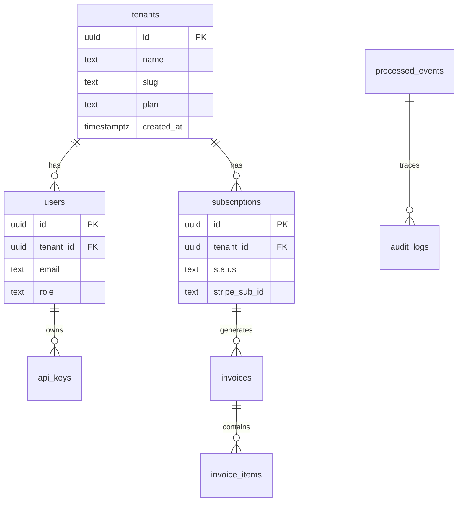

# Data Model: [Producto]

**ADR:** ADR-0006-data-model
**Versión:** 1.0
**DB Engine:** PostgreSQL 15+
**Multi-tenancy:** Shared schema + RLS

## 1. Convenciones

### 1.1 Nomenclatura
- Tablas: `snake_case` en plural (ej. `users`, `invoices`)
- Columnas: `snake_case`
- PKs: `id UUID PRIMARY KEY DEFAULT uuid_generate_v4()`
- FKs: `{entity_singular}_id UUID NOT NULL REFERENCES ...`
- Timestamps: `created_at TIMESTAMPTZ`, `updated_at TIMESTAMPTZ`, `deleted_at TIMESTAMPTZ` (soft delete)

### 1.2 Campos obligatorios en tablas de negocio
- `tenant_id UUID NOT NULL REFERENCES tenants(id)`
- `created_at`, `updated_at`
- `created_by UUID REFERENCES users(id)` (opcional)

### 1.3 Tipos financieros
- **NUNCA** `FLOAT`, `DOUBLE PRECISION`, `REAL`
- **SIEMPRE** `NUMERIC(20, 4)` o `BIGINT` (cents)
- ADR-0007 documenta la elección

### 1.4 Índices estándar
- PK siempre indexado
- FK siempre indexado
- `(tenant_id, ...)` para queries frecuentes
- GIN para JSONB con búsquedas

## 2. Diagrama ER (Mermaid)



## 3. Tablas globales (sin tenant_id)

### `tenants`
| Columna | Tipo | Constraints | Clasificación |
|---------|------|-------------|---------------|
| id | UUID | PK | internal |
| name | TEXT | NOT NULL | confidential |
| slug | TEXT | UNIQUE | internal |
| plan | TEXT | NOT NULL | internal |
| status | TEXT | NOT NULL | internal |
| created_at | TIMESTAMPTZ | DEFAULT NOW | internal |

### `users`
| Columna | Tipo | Constraints | Clasificación |
|---------|------|-------------|---------------|
| id | UUID | PK | internal |
| tenant_id | UUID | FK NOT NULL | internal |
| email | TEXT | UNIQUE | confidential |
| password_hash | TEXT | NOT NULL | restricted |
| role | TEXT | NOT NULL | internal |

### `processed_events` (idempotencia webhooks)
| Columna | Tipo | Constraints |
|---------|------|-------------|
| event_id | TEXT | NOT NULL |
| provider | TEXT | NOT NULL |
| processed_at | TIMESTAMPTZ | DEFAULT NOW |
| **UNIQUE(event_id, provider)** | | |

## 4. Tablas de negocio (con tenant_id)

### `invoices`
| Columna | Tipo | Clasificación | Notas |
|---------|------|---------------|-------|
| id | UUID | internal | PK |
| tenant_id | UUID | internal | FK |
| amount_cents | BIGINT | confidential | Nunca FLOAT |
| currency | TEXT(3) | internal | ISO 4217 |
| status | TEXT | internal | ENUM |
| stripe_invoice_id | TEXT | restricted | |

## 5. Row Level Security (RLS)

```sql
-- Ejemplo para tabla invoices
ALTER TABLE invoices ENABLE ROW LEVEL SECURITY;

CREATE POLICY tenant_isolation ON invoices
USING (tenant_id = current_setting('app.current_tenant_id')::uuid)
WITH CHECK (tenant_id = current_setting('app.current_tenant_id')::uuid);
```

**Invariantes relacionadas:** INV-001, INV-005

## 6. Soft delete vs hard delete

| Tabla | Estrategia | Justificación |
|-------|-----------|---------------|
| users | Soft delete | Auditoría |
| invoices | **Hard delete prohibido** | Compliance financiero |
| audit_logs | Nunca se borra | Inmutabilidad |
| sessions | Hard delete | Privacy |

## 7. Migraciones

- **Herramienta:** Alembic / golang-migrate / Flyway
- **Convención de nombres:** `YYYYMMDD_HHMMSS_description.sql`
- **Política:** Toda migración debe tener `up` y `down`
- **Tablas >100k rows:** Expand-and-Contract obligatorio (ver ADR-0008)

## 8. Backup y recovery
- **Frecuencia:** Continuous (PITR)
- **Retención:** 30 días
- **Pruebas de restore:** Quarterly
- **RPO objetivo:** 5 min
- **RTO objetivo:** 1 hora

## 9. Trazabilidad a clasificación de datos
Ver `data-classification.yaml` para el mapeo campo-por-campo.
