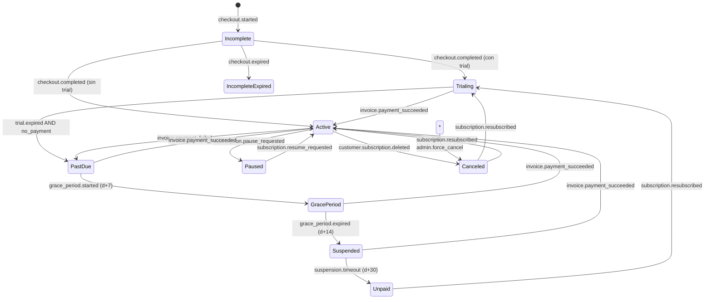

# Billing State Machine: [Nombre del componente]

**ADR relacionado:** ADR-0002, ADR-0003
**Versión:** 1.0
**Owner:** @billing-lead
**Última revisión:** YYYY-MM-DD

## 1. Estados

| Estado | Descripción | Premium features | Billing UI | Data access |
|--------|-------------|:----------------:|:----------:|:-----------:|
| **Incomplete** | Checkout iniciado, no completado | ❌ | ✅ | ❌ |
| **Trialing** | Período de prueba activo | ✅ | ✅ | ✅ |
| **Active** | Suscripción vigente y pagada | ✅ | ✅ | ✅ |
| **PastDue** | Pago fallido, dentro de grace period | ⚠️ Degradado | ✅ | ✅ |
| **GracePeriod** | Período de gracia post-PastDue | ❌ | ✅ | Read-only |
| **Suspended** | Cuenta suspendida | ❌ | ✅ | Read + Export |
| **Paused** | Pausada por usuario | ❌ | ✅ | Read-only |
| **Canceled** | Cancelada (al final del período) | ✅ hasta end | ✅ | ✅ hasta end |
| **Unpaid** | Cancelada por falta de pago | ❌ | ✅ | Export only |

## 2. Diagrama de transiciones



## 3. Transiciones detalladas

### 3.1 Incomplete → Trialing

**Evento:** `checkout.completed`

**Condiciones:**
- [ ] Firma del webhook válida (INV-003)
- [ ] `event_id` no procesado (INV-004)
- [ ] Checkout session coincide con tenant
- [ ] Plan tiene trial habilitado

**Acciones:**
1. INSERT en `processed_events`
2. Crear subscription en DB
3. Emitir evento `subscription.started`
4. Enviar email de bienvenida

**Errores posibles:**
| Error | Status | Acción |
|-------|:------:|--------|
| Firma inválida | 401 | Log + alert |
| Evento duplicado | 200 | Skip (idempotente) |
| Plan no existe | 500 | Alert P1 |

### 3.2 Trialing → Active

**Evento:** `invoice.payment_succeeded`

**Condiciones:**
- [ ] Firma válida
- [ ] Evento no procesado
- [ ] Invoice corresponde al tenant
- [ ] Monto coincide con plan

**Acciones:**
1. INSERT en `processed_events`
2. UPDATE subscription SET status = 'Active'
3. Activar entitlements premium
4. Emitir `subscription.activated`
5. Actualizar analytics

### 3.3 Active → PastDue

**Evento:** `invoice.payment_failed`

**Condiciones:**
- [ ] Firma válida
- [ ] Evento no procesado
- [ ] Retry count < max (default: 4)

**Acciones:**
1. INSERT en `processed_events`
2. UPDATE subscription SET status = 'PastDue'
3. Degradar entitlements premium
4. Enviar email de pago fallido
5. Emitir `subscription.past_due`

**Comunicación al cliente:**
- Email #1 (inmediato): "We couldn't process your payment"
- Email #2 (d+3): Reminder
- Email #3 (d+7): "Your account will be suspended"

### 3.4 PastDue → Suspended

**Evento:** `grace_period.expired`

**Trigger:** Job diario revisa subscriptions PastDue con más de 14 días

**Acciones:**
1. UPDATE subscription SET status = 'Suspended'
2. Desactivar entitlements
3. Cancelar jobs programados del tenant
4. Enviar email de suspensión
5. Emitir `subscription.suspended`

**Data handling:**
- Datos se preservan
- Acceso read-only
- Export disponible
- API retorna 403 para writes no-billing

### 3.5 * → Canceled (admin force)

**Evento:** `admin.force_cancel`

**Requiere:**
- [ ] AuthZ: solo `support:force_cancel` permission
- [ ] Audit log obligatorio
- [ ] ADR documentando razón

**Acciones:**
1. UPDATE subscription SET status = 'Canceled'
2. Log en `billing_admin_actions` con reason
3. Emitir `subscription.force_canceled`
4. Notificar compliance team

## 4. Eventos idempotentes

| Evento | Idempotencia key | Tabla |
|--------|------------------|-------|
| `checkout.completed` | checkout_session_id | processed_events |
| `invoice.payment_succeeded` | invoice_id | processed_events |
| `invoice.payment_failed` | invoice_id + attempt | processed_events |
| `customer.subscription.deleted` | subscription_id | processed_events |

**Implementación:**

```sql
CREATE TABLE processed_events (
  event_id TEXT NOT NULL,
  provider TEXT NOT NULL,
  event_type TEXT NOT NULL,
  tenant_id UUID,
  received_at TIMESTAMPTZ DEFAULT NOW(),
  processed_at TIMESTAMPTZ,
  PRIMARY KEY (event_id, provider)
);
```

## 5. Invariantes

- **INV-003:** Webhook sin firma válida → 401
- **INV-004:** Webhook duplicado → 200 OK sin mutar
- **INV-009:** Cambio de billing requiere tests de estado
- **INV-020:** Cambio de state machine requiere shadow testing

## 6. Entitlements por estado

```python
ENTITLEMENT_MATRIX = {
    "Incomplete": {
        "premium_features": False,
        "api_access": False,
        "billing_ui": True,
        "data_access": "none",
        "max_users": 0,
    },
    "Trialing": {
        "premium_features": True,
        "api_access": True,
        "billing_ui": True,
        "data_access": "full",
        "max_users": 10,  # Trial limit
    },
    "Active": {
        "premium_features": True,
        "api_access": True,
        "billing_ui": True,
        "data_access": "full",
        "max_users": "plan_limit",  # Según plan
    },
    "PastDue": {
        "premium_features": "degraded",  # Warning banners
        "api_access": True,
        "billing_ui": True,
        "data_access": "full",
        "max_users": "plan_limit",
    },
    "GracePeriod": {
        "premium_features": False,
        "api_access": "readonly",
        "billing_ui": True,
        "data_access": "readonly",
        "max_users": "current",  # No new users
    },
    "Suspended": {
        "premium_features": False,
        "api_access": "readonly",
        "billing_ui": True,
        "data_access": "export_only",
        "max_users": "current",
    },
    "Paused": {
        "premium_features": False,
        "api_access": "readonly",
        "billing_ui": True,
        "data_access": "readonly",
        "max_users": "current",
    },
    "Canceled": {
        "premium_features": False,
        "api_access": False,
        "billing_ui": True,  # Por ventana de gracia
        "data_access": "export_only",
        "max_users": 0,
    },
    "Unpaid": {
        "premium_features": False,
        "api_access": False,
        "billing_ui": True,
        "data_access": "export_only",
        "max_users": 0,
    },
}
```

## 7. Tests obligatorios

### Unit tests

```python
def test_state_machine_transition_incomplete_to_trialing():
    """Checkout with trial creates Trialing subscription."""
    ...

def test_state_machine_rejects_invalid_transition():
    """Cannot go from Suspended to Trialing directly."""
    ...
```

### Integration tests

```python
def test_payment_succeeded_activates_subscription():
    """invoice.payment_succeeded moves PastDue → Active."""
    ...

def test_payment_succeeded_idempotent():
    """Second invoice.payment_succeeded with same ID is no-op."""
    ...
```

### Webhook security tests

```python
def test_invalid_signature_returns_401():
    ...

def test_replay_attack_returns_200_noop():
    ...

def test_tenant_mapping_prevents_cross_activation():
    """Webhook for customer A cannot activate tenant B."""
    ...
```

### Entitlement tests

```python
def test_pastdue_user_gets_403_on_premium():
    ...

def test_suspended_user_can_export_data():
    ...

def test_suspended_user_cannot_create_resource():
    ...
```

### Regression tests

Por cada bug encontrado en state machine, agregar test que:
1. Reproduzca el bug
2. Valide el fix
3. Documente el escenario en comentario

## 8. Shadow testing (INV-020)

**Cuándo:** Todo cambio a state machine o lógica de entitlements

**Duración:** 7 días mínimo o 10,000 eventos

**Métrica:** 0% discrepancia en mutaciones financieras

**Proceso:**
1. Activar `SHADOW_MODE=true` en feature flag
2. Procesar cada webhook con lógica vieja (persiste) y nueva (solo log)
3. Comparar resultados
4. Alertar si discrepancia
5. Si 0 discrepancias por 7 días → promover
6. Shadow Safety Contract activo todo el tiempo

## 9. Observabilidad

### Métricas

- `subscriptions_by_state{state}`: gauge
- `state_transitions_total{from,to,event}`: counter
- `state_transition_latency_seconds{from,to}`: histogram
- `webhooks_received_total{event_type}`: counter
- `webhooks_duplicate_total`: counter
- `webhooks_invalid_signature_total`: counter

### Alertas

- `state_transitions_total{from="PastDue",to="Active"} == 0` por 24h → P2
- `webhooks_invalid_signature_rate > 1%` → P2
- `subscriptions_in_PastDue > 10%` → P3 (puede indicar problema sistémico)

## 10. Audit log

Toda transición registra:

```json
{
  "timestamp": "2026-05-27T10:00:00Z",
  "tenant_id": "uuid",
  "subscription_id": "uuid",
  "from_state": "PastDue",
  "to_state": "Active",
  "event_id": "evt_xxx",
  "event_type": "invoice.payment_succeeded",
  "actor": "system",
  "metadata": {
    "invoice_id": "inv_xxx",
    "amount_cents": 9900
  }
}
```

**Retención:** 7 años (compliance financiero)

## 11. Disaster recovery

### Escenario: Stripe webhook down por horas

**Acción:**
1. Activar degraded mode (feature flag)
2. Polling API de Stripe cada 5 min para eventos críticos
3. Reconciliación manual cuando Stripe restablezca

### Escenario: Bug en state machine causó transiciones incorrectas

**Acción:**
1. Pausar procesamiento de webhooks
2. Identificar tenants afectados
3. Script de corrección masiva con ADR
4. Comunicación a clientes afectados
5. Post-mortem

## 12. Changelog

| Fecha | Versión | Cambio | ADR |
|-------|:-------:|--------|-----|
| 2026-05-27 | 1.0 | Initial version | ADR-0002 |
